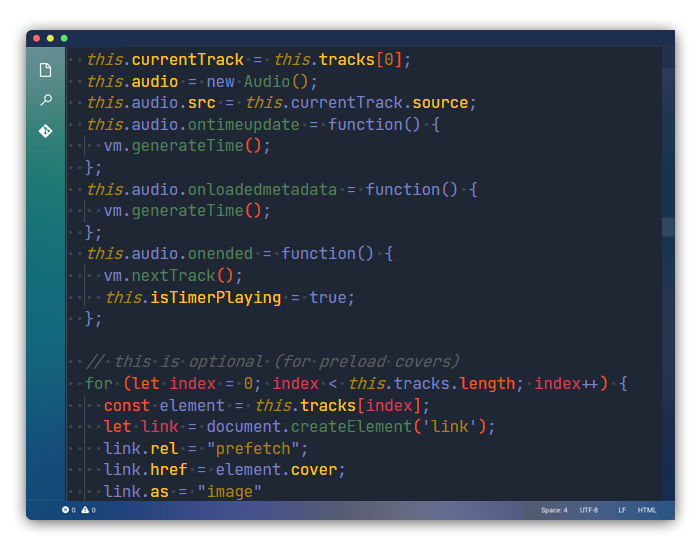

## Lotus - a dark [Sublime Text](https://www.sublimetext.com) color scheme

### Free Font used - [JetBrains Mono](https://www.jetbrains.com/lp/mono/)

## Install using Package Control

1. Enter `Package Control: Install Package`
2. Search for `Lotus Color Scheme`

## Activating the Lotus Color Scheme

Using the Command Palette, search for **UI: Select color scheme** and select:

- **Lotus**.sublime-color-scheme

## Another way

- go to **Preferences > Color Scheme** and select **Lotus**

**Customization**

	"theme": "Adaptive.sublime-theme",
	"color_scheme": "Packages/Lotus/Lotus.sublime-color-scheme",	
	"caret_extra_bottom": 1,
	"caret_extra_top": 1,
	"caret_extra_width": 0,	
	"font_face": "JetBrains Mono",
	"font_size": 10,	
	"highlight_modified_tabs": true,
	"line_padding_bottom": 1,
	"line_padding_top": 1,
	
	## Sublime Text Icon	

Download the **[Sublime Text](https://github.com/luxelego/sublime_icons)** app icon replacement. 

    

## Usage license

This work is licensed under a [MIT license](https://github.com/luxelego/lotus_color_scheme/blob/main/LICENSE).
